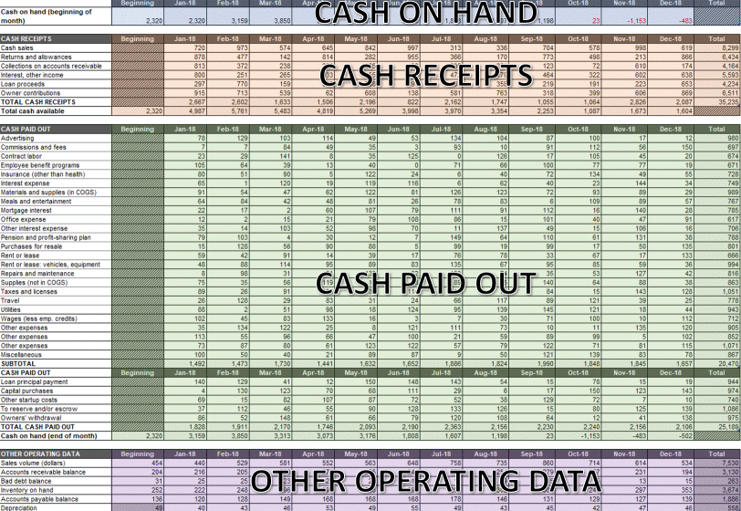
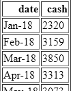
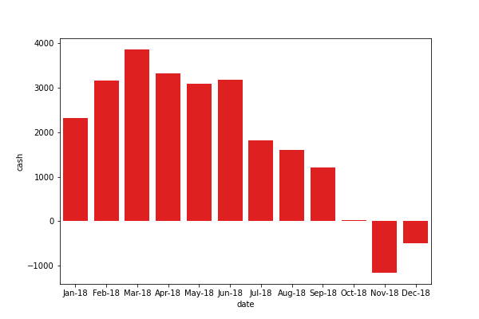
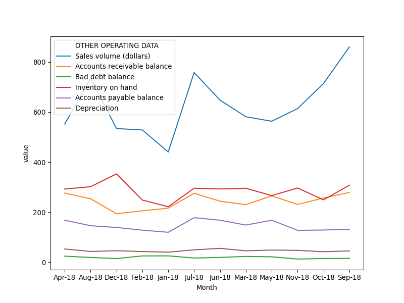

# Cash flow

A [small business cash flow projection](https://templates.office.com/en-in/small-business-cash-flow-projection-tm16410107)
generally has a single Excel sheet with multiple sections:

1. Cash on hand
2. Cash receipts
3. Cash paid out
4. Other operating data

[{.img-fluid}](cashflow.xlsx)

We'll use [FormHandler](../) to expose the data in these sheets as simple charts.

## Expose Excel data

Download the dataset [cashflow.xlsx](cashflow.xlsx).

This file has 5 pre-defined tables, which you can view via the Name Manager (`Ctrl-F3`).

{.img-fluid}

1. CashOnHand
2. CashPaidOut
3. CashReceipts
4. Expenses
5. OtherOperationalData

Let's expose the `OtherOperationalData` table via FormHandler. Create this `gramex.yaml` with this content:

```yaml
url:
  formhandler/cashflow/data:
    pattern: /$YAMLURL/data
    handler: FormHandler
    kwargs:
      url: $YAMLPATH/cashflow.xlsx
      table: OtherOperationalData
```

[Run Gramex and visit the `/data` page](data). You should see the Excel table as JSON:

```json
[{"OTHER OPERATING DATA":"Sales volume (dollars)","Beginning":454,"Jan-18":440.461,...}]
```

[To see the page as a HTML table, visit `/data/?_format=html`](data?_format=html)

## Prepare the data

Let's create a bar chart to show the `CashOnHand` table. For this, we need to prepare data.

Add this to `gramex.yaml`:

```yaml
  formhandler/cashflow/chart:
    pattern: /$YAMLURL/chart
    handler: FormHandler
    kwargs:
      url: $YAMLPATH/cashflow.xlsx
      name: CashChart
```

[Visit the `/chart` page](chart1). You should see the `CashChart` named range data as JSON:

```json
[{"Jan-18":2320,"Feb-18":3159,"Mar-18":3850,...}]
```

[Visit `/chart?_format=html` page](chart1?_format=html) to see this as HTML:

{.img-fluid}

Let's convert this into a format that we can use for charts. Add this function to transform the data:

```yaml
      function: "data.T.reset_index().rename(columns={'index': 'date', 0: 'cash'})"
```

This does the following:

- `.T` rotates the data 90°, transposing rows and columns
- `.reset_index()` converts the headers `Jan-18`, `Feb-18`, etc into a column called `index`
- `.rename(...)` renames the columns into `date` and `cash`, which makes it easy to refer to them

[Now, the data looks like this](chart?_format=html):

{.img-fluid}

## Create the chart

Add this to your `gramex.yaml`:

```yaml
        barchart:                       # Define a format called barchart
          format: seaborn               # This uses seaborn as the format
          chart: barplot                # Chart can be any standard seaborn chart
          x: date                       # Use 'date' column for the bars
          y: cash                       # Use 'cash' column for height of the bars
          color: '#2A9DF4'              # Bar chart color is a light blue
          width: 800                    # Width in pixels. Default: 640
          height: 600                   # Height in pixels. Default: 480
          dpi: 96                       # Zoom (dots per inch)
          ext: png                      # Use a matplot backend (svg, pdf, png)
          headers:
            Content-Type: image/png     # Set the corresponding MIME type
```

[Now, visit `chart?_format=barchart` to see this bar chart](chart?_format=barchart)

[{.img-fluid}](chart?_format=barchart)

## Customize the chart

You can now embed [this chart URL `chart?_format=barchart`](chart?_format=barchart) in any application.

To customize its appearance using URL query parameters, change the `color`, `width`, and `height` lines in `gramex.yaml` from:

```yaml
          color: '#2A9DF4'              # Bar chart color is a light blue
          width: 800                    # Width in pixels. Default: 640
          height: 600                   # Height in pixels. Default: 480
          dpi: 96                       # Zoom (dots per inch)
```

... to ...

```yaml
          color: '{color}'              # Bar chart color is a light blue
          width: '{width}'              # Width in pixels. Default: 640
          height: '{height}'            # Height in pixels. Default: 480
          dpi: '{dpi}'                  # Zoom (dots per inch)
```

Then, add this to your `gramex.yaml`:

```yaml
      default:
        color: '#2A9DF4'
        width: 800
        height: 600
        dpi: 96
```

This picks up the color, width and height from the URL query parameters. For example, [`chart?_format=barchart&color=red&width=600&height=400&dpi=72`](chart?_format=barchart&color=red&width=600&height=400&dpi=72) looks like this:

[{.img-fluid}](chart?_format=barchart&color=red&width=600&height=400&dpi=72)

When embedding this into another application, you can change the URL to control the style of the chart.

## Create another chart

Using the same cash flow data, let's create another chart that shows operational data.

```yaml
  formhandler/cashflow/operational:
    pattern: /$YAMLURL/operational
    handler: FormHandler
    kwargs:
      url: $YAMLPATH/cashflow.xlsx
      table: OtherOperationalData
      function: |
        (data                                   # Take the data
        .drop(columns=['Beginning', 'Total'])   # Remove these columns
        .melt(                                  # "Unpivot" the table
          id_vars=['OTHER OPERATING DATA'],     # using OTHER OPERATING DATA
          var_name='Month'))                    # ... and Month
      formats:
        linechart:                      # Define a format called linechart
          format: seaborn               # This uses seaborn as the format
          chart: lineplot               # Pick the lineplot chart type
          x: Month                      # Use 'Month' column for the X-axis
          y: value                      # Use 'value' column for the Y-axis
          hue: OTHER OPERATING DATA     # Color by the OTHER OPERATING DATA col
          width: '{width}'              # Width in pixels. Default: 640
          height: '{height}'            # Height in pixels. Default: 480
          dpi: '{dpi}'                  # Zoom (dots per inch)
          ext: png                      # Use a matplot backend (svg, pdf, png)
          headers:
            Content-Type: image/png     # Set the corresponding MIME type
      default:
        width: 800
        height: 600
        dpi: 96
```

[This creates a chart at `operational?_format=linechart`](operational?_format=linechart)

[{.img-fluid}](operational?_format=linechart)

You can use [FormHandler filters](../#formhandler-filters) to restrict the data to specific rows. You can also use `?width=`, `?height=` and `?dpi=` to control the size. For example:

[operational?_format=linechart&OTHER OPERATING DATA=Depreciation&height=250](operational?_format=linechart&OTHER%20OPERATING%20DATA=Depreciation&height=250)

[](operational?_format=linechart&OTHER%20OPERATING%20DATA=Depreciation&height=250)

[operational?_format=linechart&OTHER OPERATING DATA=Accounts payable balance&OTHER OPERATING DATA=Accounts receivable balance&height=250](operational?_format=linechart&OTHER%20OPERATING%20DATA=Accounts%20payable%20balance&OTHER%20OPERATING%20DATA=Accounts%20receivable%20balance&height=250)

[](operational?_format=linechart&OTHER%20OPERATING%20DATA=Accounts%20payable%20balance&OTHER%20OPERATING%20DATA=Accounts%20receivable%20balance&height=250)

## See the result

- [This is the dataset: cashflow.xlsx](cashflow.xlsx)
- [This is the final configuration: gramex.yaml](gramex.yaml.source){.source}
- Try it out yourself!
