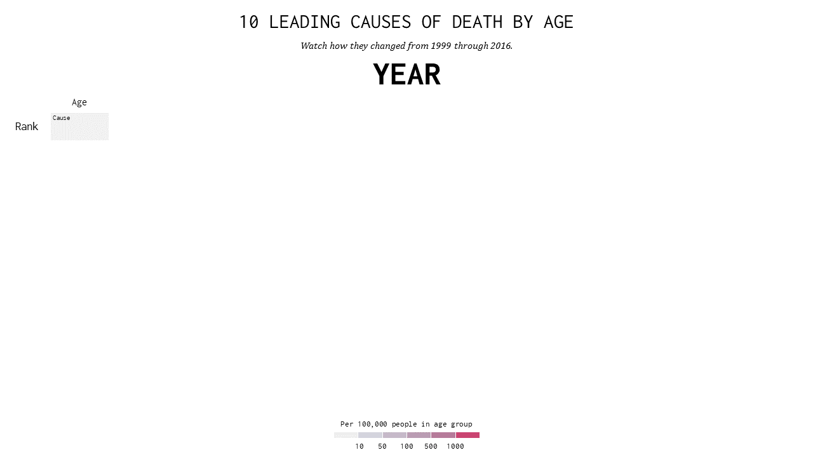
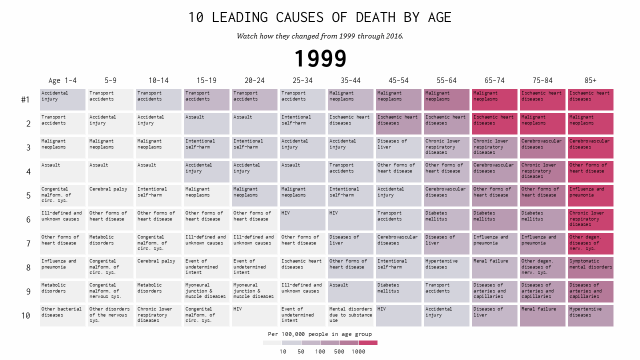
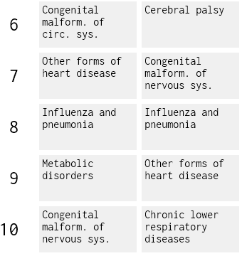
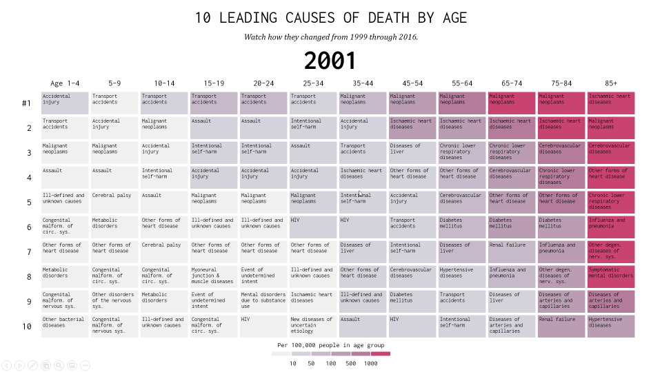

# Shifting Causes of Death

Let's see how we can create this visual on the "[Shifting Causes of Death](https://flowingdata.com/2018/10/02/shifting-death/)" using PPTXHandler.

{.img-fluid}

This shows the top 10 causes of death by age group, across years. Data is from the [CDC Wonder Database](https://wonder.cdc.gov/), and the visualization was created by [Nathan Yau](https://flowingdata.com/).

## Create the source template

Start by creating a [template.pptx](template.pptx) that has the static content laid out.

[{.img-fluid}](template.pptx)

It has 4 shapes that will be updated from data:

1. `Year`: the current year, e.g. 1996, 1997, ...
2. `Age`: the age group, e.g. Age 1-4, 5-9, ...
3. `Rank`: the rank of the cause of death, e.g. #1, 2, ...
4. `Cause`: the actual cause of death, e.g. Assault, HIV, ...

## Create the data

The [data][data] is available from the [Flowing Data
website](https://flowingdata.com/projects/2018/mortality-ranks/). To simplify things, we combine
Male & Female rates, re-rank them, and save this as [mortality.xlsx](mortality.xlsx).

[{.img-fluid}](mortality.xlsx)

The relevant columns correspond to the shape names on the template:

- `age`: the age group
- `year`: the current year
- `cause`: the actual cause of death
- `rank`: the rank of the cause of death

## Create the rules

Let's set up a basic `gramex.yaml` file that loads the template and the data.

```yaml
url:
  pptxhandler/death:
    pattern: /$YAMLURL/output.pptx
    handler: PPTXHandler
    kwargs:
      version: 2
      source: $YAMLPATH/template.pptx
      data:
        url: $YAMLPATH/mortality.xlsx
        transform: data[data['rank'] <= 10]
```

Now, we'll set up a rule that copies the slide for each year.

```yaml
      rules:
        - copy-slide: data.groupby('year')
```

This copies the slide for each year. The variable `copy.key` holds the year. `copy.val` has the data for the year.

Next, let's set the year on each slide:

```yaml
          'Year':
            text: copy.key
```

{.img-fluid}

Now, we'll clone the `Rank` shape for each rank from 1 to 10.

```yaml
          Rank:
            clone-shape: '["#1", 2, 3, 4, 5, 6, 7, 8, 9, 10]'
            add-top: clone.pos * 0.5
            text: clone.val
```

We explicitly set the ranks as an array. The first rank is shown as `#1`. The rest are 2, 3, ...
`add-top:` moves the cloned Rank down by `clone.pos * 0.5`. `clone.pos` goes from 0 to 9. So the
first Rank `#1` is at the original position. The rest move down by 0.5" (half-an-inch -- determined
by trial-and-error) from the previous.

The text shown is the value in our `clone-shape:` array.

{.img-fluid}

Now, we'll clone the `Age` shape for each age in the dataset.

```yaml
          Age:
            clone-shape: copy.val.groupby('age', sort=False)
            add-left: clone.pos * 1
            text: clone.key if clone.pos else f'Age {clone.key}'
```

We clone based on the current slide's value (`copy.val`), grouped by age. This creates one clone
per age group. Don't sort it, because it's already sorted in [`mortality.xlsx`](mortality.xlsx)
(and sorting would mess it up: `5-9` would appear after `55-64`.)

`add-left:` moves the cloned Age right by `clone.pos * 1`. `clone.pos` counts the
age groups from 0 .. 11. So the first Age `1-4` is at the original position. The rest move right by
1" (one inch -- determined by trail and error) from the previous.

The `text:` is set up to show `Age 1-4` in the first column, `5-9` on the second, and so on.

{.img-fluid}

Now, we'll clone the `Cause` shape for each row in the dataset.
```yaml
          Cause:
            clone-shape: copy.val
            add-top: clone.pos % 10 * 0.5
            add-left: clone.pos // 10 * 1
            text: clone.val.cause
            fill: >
              '#f0f0f0' if clone.val.rate < 10 else
              '#d4d4dd' if clone.val.rate < 50 else
              '#c6b9c9' if clone.val.rate < 100 else
              '#ba9cb3' if clone.val.rate < 500 else
              '#b67b9a' if clone.val.rate < 1000 else
              '#ca4471'
```

`copy.val` has every row of data for the current year. There are 120 entries -- for 12 age groups
and 10 ranks. Rows 1-10 are ranks 1-10 for age 1-4, then for age 5-9, etc.

`add-top: clone.pos % 10 * 0.5` moves the cloned Cause 0.5" down based on rank. `add-left: clone.pos // 10 * 1` moves the cloned Cause 1" right based on age group.

`text: clone.val.cause` uses the "cause" field to set the text.

The fill color is set in line with the legend we created on [template.pptx](template.pptx).

{.img-fluid}

Finally, to animate the slides, let's set a transition.

```yaml
          transition:
            type: f'morph'
            duration: 0.3
            advance: 1
```

The transition takes 0.3 seconds per slide, and waits for 1 second before auto-advancing.

This almost works magically... but there's one problem. It moves the causes from one age-group
column to another. We want them to stay within the same column.

{.img-fluid}

We can [use the shape name to match morph shapes][match-shape]. By setting:

```yaml
          Cause:
            name: f'!!{clone.val.age} {clone.val.cause}'
```

... the shape name will be `!!1-4 Accidental injury`, `!!1-4 Assault`, etc. These will be moved only within the same age group, and not across.

[match-shape]: https://support.microsoft.com/en-us/office/morph-transition-tips-and-tricks-bc7f48ff-f152-4ee8-9081-d3121788024f
[data]: https://flowingdata.com/projects/2018/mortality-ranks/data/mortality_top10.tsv

[This is the final configuration](gramex.yaml.source){.source}


## See the result

[This is the output PPTX](output.pptx)

[{.img-fluid}](output.pptx)
