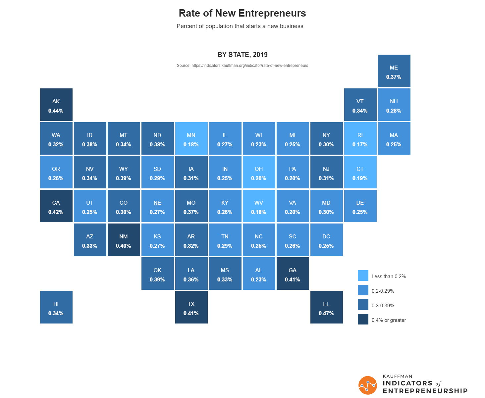
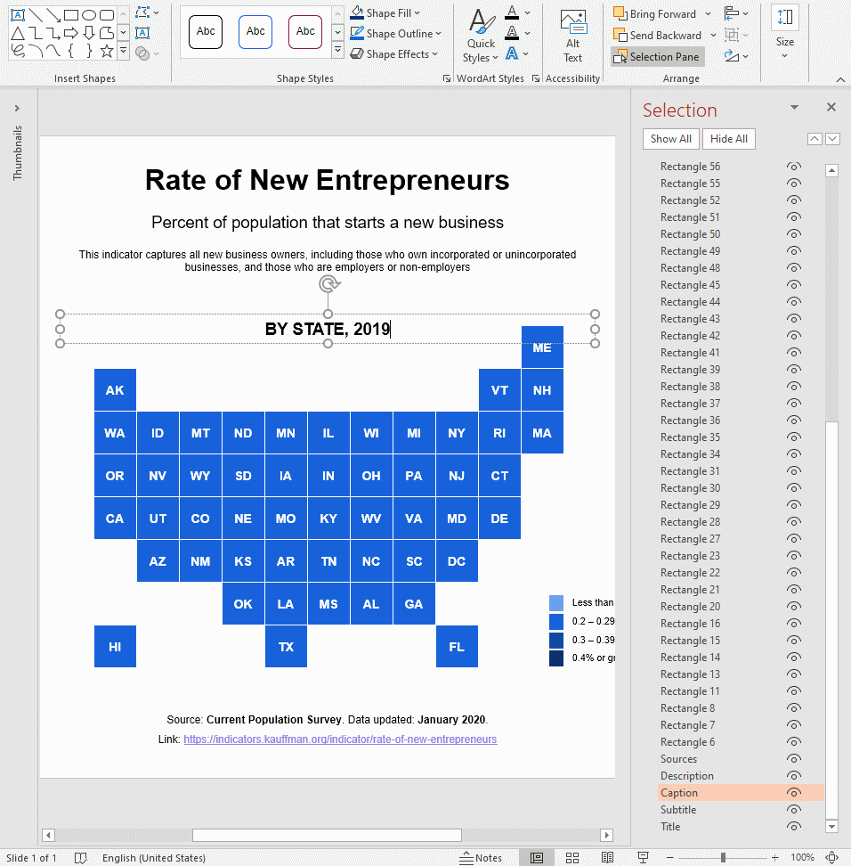

# Rate of New Entrepreneurs

Let's see how we can create this visual on the "Rate of New Entrepreneurs" using PPTXHandler.

{.img-fluid}

The [Kauffman Indicators of Entrepreneurship](https://indicators.kauffman.org/) show
entrepreneurial trends in the US. Their [entry in the Information is Beautiful
awards](https://www.informationisbeautifulawards.com/showcase/4296-kauffman-indicators-of-entrepreneurship)
shows the percentage of population that starts a new business.

Here's a video explaining each step of this tutorial.

<div class="ratio ratio-16x9">
  <iframe src="https://www.youtube.com/embed/tHaMc_Rraic" allowfullscreen></iframe>
</div>

## Create the source template

Start by creating a [template.pptx](template.pptx) that has all the 50 U.S. states + DC laid out.

[{.img-fluid}](template.pptx)

It has 51 rectangles named "Rectangle 6", "Rectangle 7", ... "Rectangle 56". The exact names and
numbers don't matter. We will identify them by the 2-letter codes in the text.

It also has text boxes for the title, sources, etc. Since we will create one slide for each year,
we'll also change "Caption" ever slide, which reads "BY STATE, 2019".

## Create the data

The [data][data] is available from the [Kauffman Indicators Data Downloads page][downloads]. Let's
save this as [data.csv](data.csv).

[](data.csv)

The relevant columns are:

- `code`: The state code
- `year`: Year
- `rne`: Rate of new entrepreneurs

## Create the rules

Let's set up a basic `gramex.yaml` file that loads the template and the data.

```yaml
url:
  pptxhandler/entrepreneurship:
    pattern: /$YAMLURL/output.pptx
    handler: PPTXHandler
    kwargs:
      version: 2
      source: $YAMLPATH/template.pptx
      data: {url: $YAMLPATH/data.csv}
```

Now, we'll set up a rule that copies the slide for each year.

```yaml
      rules:
        - copy-slide: data.groupby('year')
          data:
            rne: copy.val.groupby('code')['rne'].first().fillna(0)
```

This copies the slide for each year. The variable `copy.key` holds the year. `copy.val` has the data for the year.

To conveniently access the `rne` column, we created a dataset called `rne`. It picks the first (and
only) `rne` field for each state code that year. So, `rne["CA"]` has the RNE for California.

Next, let's change the *color* of each `Rectangle *` shape. This matches all shape names starting
with Rectangle.

```yaml
          'Rectangle *':
            fill: >
              "ACCENT_1+40%" if rne[shape.text] < 0.002 else
              "ACCENT_1" if rne[shape.text] < 0.003 else
              "ACCENT_1-25%" if rne[shape.text] < 0.004 else
              "ACCENT_1-50%"
```

The fill color is set in line with the legend we created on [template.pptx](template.pptx).

Next, let's change the *text* of each `Rectangle *` shape.

```yaml
            text: f'<p>{shape.text}</p><p><a bold="n" font-size="8 pt">{rne[shape.text]:.2%}</a></p>'
```

- `<p>{shape.text}</p>` creates the first line with the state name. (The source rectangles are bold. So is this.)
- `<p><a bold="n" font-size="8 pt">{rne[shape.text]:.2%}</a></p>` creates the second line with the
  RNE value as a percentage. It's 8 pt (a bit smaller) and not bold.

This creates a result like this for each state:


Finally, change the caption every slide. `{copy.key}` is the year.

```yaml
          Caption:
            text: f'BY STATE, {copy.key}'
```

[This is the final configuration](gramex.yaml.source){.source}


[data]: https://indicators.kauffman.org/wp-content/uploads/sites/2/2020/05/Kauffman-Indicators-of-Early-stage-Entrepreneurship-%E2%80%93-Data-2019.csv
[downloads]: https://indicators.kauffman.org/data-downloads

## See the result

[This is the output PPTX](output.pptx)

[](output.pptx)
